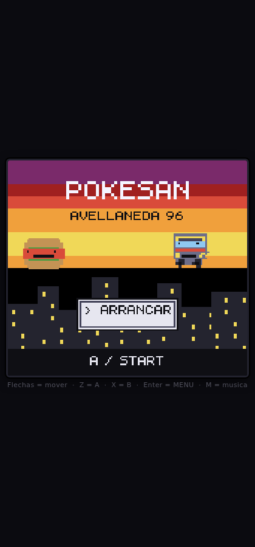
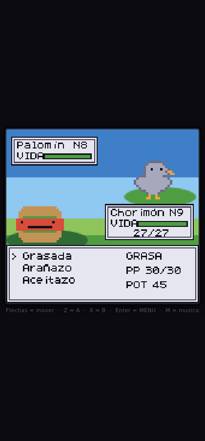
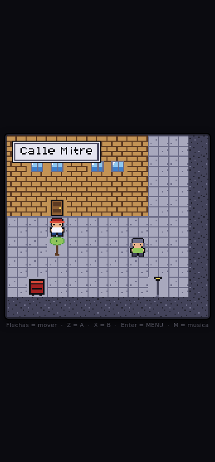
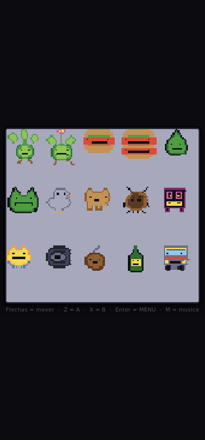

# Pokesán — Avellaneda 96

Un jueguito de bichos estilo Game Boy Color, pero en las calles de Avellaneda
en los 90. Chiste y homenaje. Un solo archivo HTML, se abre solo, no necesita
emulador, ni internet, ni instalar nada.



## Cómo se juega

1. Bajate **`Pokesan.html`**.
2. Abrilo. Listo. Se abre en el navegador del celular o de la compu.

Para mandarlo por WhatsApp: adjuntar → **Documento** → elegir `Pokesan.html`.
Pesa ~120 KB, entra en cualquier lado.

> Si desde WhatsApp no te lo abre directo: tocá "Descargar", después abrilo
> desde la carpeta **Descargas** con Chrome. La partida se guarda en el
> teléfono (START → GUARDAR).

### Controles

| | Teclado | Celular |
|---|---|---|
| Moverse | Flechas / WASD | Cruceta en pantalla |
| A (hablar, confirmar) | `Z` / `Espacio` | Botón A |
| B (volver) | `X` | Botón B |
| Menú | `Enter` | START |
| Música on/off | `M` | SON |

## De qué va

Sos un pibe de Calle Mitre. Chirola, el de la ferretería, se puso a estudiar
los bichos raros que aparecieron en el baldío y te da uno para que le llenes
la libreta. Hay que juntar tres medallas y ganarle al Colectivero del 22 para
tener el pase libre de por vida, que es lo máximo a lo que se puede aspirar.

- **10 lugares**: tu pieza, Calle Mitre, el kiosco de Ramón, el taller de
  Chirola, el depto del 2do B, Plaza Alsina, afuera de la cancha, el baldío,
  la orilla del Riachuelo y la terminal del 22.
- **15 bichos**: Chorimón, Yuyín, Riachín, Palomín, Perrucho, Cucaracho,
  Cumbión, Trapín, Gomón, Materazzo, Fernetón, Bondimón y tres evoluciones.
- **7 tipos**: GRASA, YUYO, PODRIDO, FIERRO, CHAMUYO, CORRIENTE y VOLADOR,
  con ventajas y desventajas entre sí.
- **15 duelos**, incluidas 3 medallas y el jefe final.
- Chapitas para atrapar bichos, kiosco donde comprar y curar, subir de nivel,
  aprender ataques, evolucionar, guardado en el teléfono.

Son entre 45 minutos y una hora y pico de juego, según cuánto te pongas a
cazar bichos.

 



## Para meterle mano

El HTML final se arma a partir de `src/`:

```sh
sh build.sh          # arma Pokesan.html
```

| archivo | qué tiene |
|---|---|
| `src/00_head.html` | HTML, estilos y botones táctiles |
| `src/10_font.js` | tipografía de 5x7 pixeles dibujada a mano |
| `src/15_core.js` | pantalla, paleta, sprites, controles, audio, guardado |
| `src/20_tiles.js` | los tiles de 16x16 (vereda, asfalto, ladrillo, agua...) |
| `src/25_sprites.js` | gente del barrio y arte de los bichos |
| `src/30_data.js` | tipos, ataques, bichos y objetos |
| `src/40_maps.js` | mapas, vecinos, diálogos y duelos |
| `src/50_mundo.js` | caminar, hablar, encuentros |
| `src/60_batalla.js` | el sistema de combate |
| `src/70_menus.js` | menús, kiosco y escenas |
| `src/80_main.js` | pantalla de título y bucle principal |

Agregar un bicho es sumar su arte en `25_sprites.js` y su ficha en
`30_data.js`. Agregar un mapa es sumar las filas de tiles y los vecinos en
`40_maps.js`. Todo el arte es texto: cada caracter es un pixel de la paleta
definida en `15_core.js`.

### Pruebas

Hay tres scripts que abren el juego en Chromium y lo juegan solos:

```sh
NODE_PATH=$(npm root -g) node test/driver.js   # capturas de cada pantalla
NODE_PATH=$(npm root -g) node test/flujo.js    # partida completa hasta el final
NODE_PATH=$(npm root -g) node test/stress.js   # captura, derrota y teclas al azar
```

## Nota

Es un homenaje hecho a mano, sin nada de material original de nadie: los
bichos, los sprites, la tipografía, la música y los mapas están dibujados y
escritos para este proyecto.

---

# No sale el sol — Avellaneda 2026

El segundo juego del repo, sobre el mismo motor. Policial negro: hace un mes
que no sale el sol, anuncian estado de sitio en 24 horas, y a la persona que
te vende se la acaban de llevar dejando tu documento tirado en el piso.

Un solo archivo: **`NoSaleElSol.html`**. Se abre igual que el otro.

## Qué tiene

- **Mapa del partido de Avellaneda** con las nueve localidades, el Riachuelo,
  la Mitre, la Belgrano y la autopista. Veinte lugares. En el mapa no caminás:
  **manejás un Ford Fox**, y los minutos de viaje salen de la distancia real
  entre un punto y otro.
- **Reloj de 24 horas.** Arranca a las 20:00 y a las 06:00 entra el estado de
  sitio. Veinte lugares, no te da para todos.
- **Duelos de berretines.** No hay piñas: se pelea hablando. El rival te tira
  una y tenés tres respuestas. Los retruques se aprenden perdiendo y quedan
  anotados en la libreta.
- **El aguante.** Se te va con las horas. Fundido, entrás a los cruces con una
  vida menos. El juego cuenta cuántas veces aguantaste y no te lo dice nunca.
- **La libreta**: pistas, berretines, bolsillos, y ATAR CABOS — cuando tenés
  lo necesario, el caso se resuelve solo y se abre un lugar nuevo en el mapa.
- **Dos paletas.** Todo el juego es de noche. El flashback de 2010 y el final
  son las dos únicas veces que hay sol, y el cambio se ve.
- **Ocho finales** según a quién ayudaste, cuánta guita te queda, si cazaste
  la pista de una sola letra, y cuántas veces aguantaste.

## Para meterle mano

```sh
sh build2.sh    # arma NoSaleElSol.html desde src2/
NODE_PATH=$(npm root -g) node test/nse.js   # lo juega solo de punta a punta
```

El guion vive en `src2/35_guion.js`, los mapas en `src2/40_mapas.js` y las
veinte zonas con sus coordenadas en `src2/30_datos.js`. La historia completa
está en `BIBLIA.md`.
